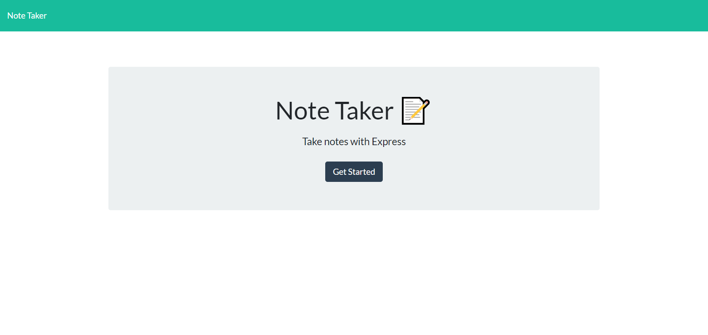
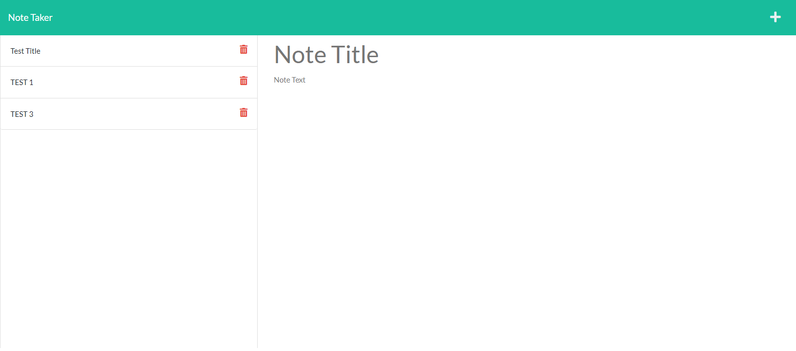

# John Kang, Module 11; Note Taker 

## Description

The purpose of this assignment was to use node.js and express.js to generate a note taker app that can add and delete notes to a database. Saved notes are still availble on the deployed site through the db.json and can be veiwed at a later time if needed.

## Screenshot of Deployed Website

### Link to the deployed website
